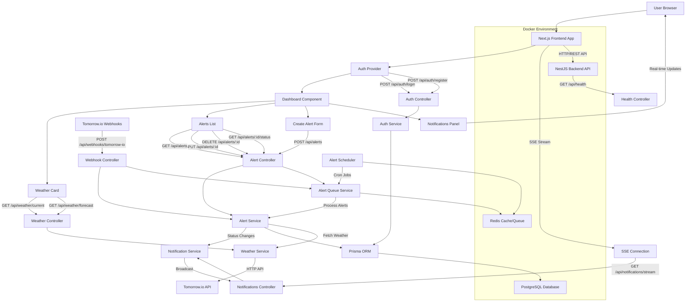

# Weatherman Stack Flow Documentation

## Redis: The Dual-Purpose Engine

Redis serves **two critical functions** in the Weatherman application:

### 1. **Weather Data Caching** 📊
**Purpose**: Optimize API performance and reduce external API calls

**Implementation**: (`WeatherService`)
- **Current Weather Cache**: 5-minute TTL (Time To Live)
- **Forecast Cache**: 1-hour TTL  
- **Batch Weather Cache**: For multiple locations

**Benefits**:
- ⚡ **Faster Response Times**: Cached weather data returns instantly
- 💰 **Cost Reduction**: Fewer Tomorrow.io API calls = lower API costs
- 🛡️ **Rate Limit Protection**: Prevents hitting Tomorrow.io rate limits
- 📈 **Better UX**: Users get immediate weather data for recently checked locations

**Cache Keys**:
```typescript
// Examples:
weather:current:tel_aviv
weather:current:32.0192,34.7712
weather:forecast:holon:3days
```

### 2. **Background Job Queue** ⚙️
**Purpose**: Handle asynchronous alert processing and scheduling

**Implementation**: (`AlertQueueService` with BullMQ)
- **Alert Processing Queue**: Evaluates all active alerts
- **Worker Jobs**: Background processing of alert conditions
- **Scheduled Jobs**: Periodic alert evaluation (cron-style)

**Job Types**:
- `process-all-alerts`: Evaluate all user alerts periodically
- `evaluate-single-alert`: Process specific alert immediately 
- `webhook-triggered-evaluation`: Handle webhook-initiated alerts

**Benefits**:
- 🔄 **Asynchronous Processing**: Alert evaluation doesn't block API responses
- ⏰ **Scheduled Tasks**: Regular alert checking without user interaction  
- 🚀 **Scalability**: Can handle many alerts without performance impact
- 🔧 **Reliability**: Job retries and failure handling

### Redis Configuration in Docker

```yaml
redis:
  image: redis:6.2-alpine
  command: redis-server --maxmemory 200mb --maxmemory-policy noeviction
  ports: ["6379:6379"]
  volumes: ["./redis:/data"]
```

**Configuration Details**:
- **Memory Limit**: 200MB (suitable for development/small production)
- **Eviction Policy**: `noeviction` - never remove data automatically
- **Persistence**: Data saved to `./redis` directory
- **Network**: Connected to app-network for inter-service communication

### Data Flow Examples

**Weather Caching Flow**:
```
1. User requests weather for "Holon"
2. WeatherService checks Redis: redis.get('weather:current:holon')
3. If cache hit → return immediately
4. If cache miss → call Tomorrow.io API → cache result → return data
5. Next request for Holon within 5 minutes = instant response
```

**Alert Queue Flow**:
```
1. AlertScheduler triggers every 15 minutes (configurable)
2. Job 'process-all-alerts' added to Redis queue
3. Worker picks up job from queue
4. AlertService.processAlerts() evaluates all active alerts
5. Weather data fetched (cached when possible)
6. Notifications sent for triggered alerts
7. Job marked as completed in Redis
```

**Webhook Processing Flow**:
```
1. Tomorrow.io webhook received
2. WebhookController adds 'evaluate-single-alert' job to Redis queue
3. Worker immediately processes webhook-triggered alert
4. Real-time notification sent if alert triggered
5. Job completed, user gets instant feedback
```

### Why Redis is Perfect for This

1. **Speed**: In-memory storage = sub-millisecond operations
2. **Dual Purpose**: Cache + Queue in one service
3. **Reliability**: Data persistence and atomic operations
4. **Scalability**: Handles high throughput for both caching and queuing
5. **Memory Efficiency**: Configurable eviction policies and TTLs

### Alternative Approaches (Not Used)

❌ **Database Caching**: Too slow, adds DB load  
❌ **Memory Caching**: Lost on restart, no persistence  
❌ **File Caching**: Slow I/O, hard to manage  
❌ **Separate Queue Service**: Additional complexity and resources

Redis provides the **perfect balance** of performance, reliability, and simplicity for both weather data caching and background job processing in your weather alert system! 🎯

## Architecture Overview

The Weatherman application is a full-stack weather alert system consisting of:
- **Frontend**: Next.js 14 with TypeScript and Tailwind CSS
- **Backend**: NestJS with TypeScript
- **Database**: PostgreSQL with Prisma ORM
- **Cache**: Redis for queue management and caching
- **External Service**: Tomorrow.io API for weather data
- **Webhook System**: Real-time weather event processing

## Complete Flow Diagram



## How Frontend Gets Notified When Webhook Triggers Alert

**Question**: When an alert is triggered from a webhook, what notifies the frontend?

**Answer**: The frontend receives real-time notifications via **Server-Sent Events (SSE)** through the following flow:

### The Complete Notification Chain

1. **Webhook Triggers**: Tomorrow.io sends webhook → `/api/webhooks/tomorrow-io`
2. **Alert Processing**: WebhookController queues alert evaluation
3. **Status Change**: AlertService evaluates weather conditions and updates alert status
4. **Notification Broadcast**: AlertService calls `NotificationService.sendAlertNotification()`
5. **SSE Stream**: NotificationService broadcasts to active SSE connections
6. **Frontend Reception**: Frontend SSE connection receives notification
7. **UI Update**: NotificationsPanel displays real-time notification + browser popup

### Key Components

- **NotificationService**: RxJS-based service that manages notification broadcasting
- **NotificationsController**: SSE endpoint at `/api/notifications/stream?token={jwt}`
- **NotificationsPanel**: Frontend component that displays real-time notifications
- **Browser Notifications**: Native browser popups when permissions granted

### Authentication for SSE

Since EventSource doesn't support custom headers, authentication is handled via query parameter:
```typescript
// Frontend
const eventSource = new EventSource(`${API_BASE_URL}/notifications/stream?token=${encodeURIComponent(token)}`)

// Backend
@Sse('stream')
streamNotifications(@Query('token') token: string) {
  const user = this.jwtService.verify(token); // Verify JWT
  return this.notificationService.getUserNotifications(user.id);
}
```

### Notification Types

- **alert_triggered**: Alert condition met (red notification)
- **alert_resolved**: Alert condition no longer met (green notification)  
- **alert_error**: Error evaluating alert (orange notification)

This ensures **immediate frontend updates** when webhooks trigger alerts, providing true real-time functionality.

## Detailed Flow Breakdown

### 1. User Authentication Flow
```
Browser → Next.js App → Auth Provider → Auth Controller → Auth Service → Database
```

**Steps:**
1. User accesses application
2. Auth Provider checks for existing token
3. If no token, shows AuthForm component
4. User submits login/register form
5. Frontend calls `/api/auth/login` or `/api/auth/register`
6. Auth Controller validates credentials
7. Auth Service checks database via Prisma
8. JWT token returned and stored in localStorage
9. User redirected to Dashboard

### 2. Weather Data Flow
```
Dashboard → Weather Card → Weather Controller → Weather Service → Tomorrow.io API
```

**Steps:**
1. User searches for location or uses current location
2. Weather Card component calls `/api/weather/current` or `/api/weather/forecast`
3. Weather Controller validates location parameters
4. Weather Service makes external API call to Tomorrow.io
5. Weather data processed and returned to frontend
6. Weather Card displays current conditions and forecast

### 3. Alert Management Flow
```
Dashboard → Create Alert Form → Alert Controller → Alert Service → Database → Alert Queue
```

**Steps:**
1. User fills out Create Alert Form
2. Frontend calls `POST /api/alerts` with alert parameters
3. Alert Controller validates and creates alert
4. Alert Service stores alert in database via Prisma
5. Alert Queue Service schedules alert evaluation
6. Background scheduler processes alerts periodically

### 4. Webhook Processing Flow with Real-time Notifications
```
Tomorrow.io → Webhook Controller → Alert Service → Alert Evaluation → NotificationService → Frontend SSE
```

**Steps:**
1. Tomorrow.io sends weather event webhook to `/api/webhooks/tomorrow-io`
2. Webhook Controller verifies signature and payload
3. Controller identifies alerts matching the location
4. Matching alerts queued for immediate evaluation
5. Alert Queue Service processes evaluations
6. Alert Service fetches current weather and checks conditions
7. **If threshold met, NotificationService sends real-time notification via SSE**
8. **Frontend receives SSE event and displays notification + browser popup**
9. Alert status updated in database

### 5. Real-time Notification Flow (NEW)
```
Alert Status Change → NotificationService → SSE Stream → Frontend NotificationPanel → Browser Popup
```

**Steps:**
1. Alert status changes (TRIGGERED/RESOLVED/ERROR) in AlertService
2. AlertService calls NotificationService.sendAlertNotification()
3. NotificationService broadcasts notification to RxJS Subject
4. Frontend SSE connection receives filtered notifications for authenticated user
5. NotificationsPanel displays notification in real-time with visual indicators
6. Browser notification popup shown (if permission granted)
7. User can interact with notifications (dismiss, view details)

### 6. Background Alert Processing
```
Cron Scheduler → Alert Queue Service → Alert Service → Weather Service → Database Update
```

**Steps:**
1. Alert Scheduler runs on configurable intervals
2. All active alerts queued for evaluation
3. Alert Queue Service processes each alert
4. Current weather data fetched for alert location
5. Alert conditions evaluated against thresholds
6. Alert status updated in database
7. Notifications sent if conditions met

## API Endpoints

### Authentication (`/api/auth`)
- `POST /api/auth/register` - Register new user
- `POST /api/auth/login` - Login and get JWT token

### Weather (`/api/weather`)
- `GET /api/weather/current?lat={lat}&lon={lon}` - Current weather by coordinates
- `GET /api/weather/current?city={city}` - Current weather by city name
- `GET /api/weather/forecast?lat={lat}&lon={lon}&days={days}` - Weather forecast

### Alerts (`/api/alerts`)
- `GET /api/alerts?userId={userId}` - Get user's alerts
- `POST /api/alerts` - Create new alert
- `GET /api/alerts/{id}` - Get specific alert
- `PUT /api/alerts/{id}` - Update alert
- `DELETE /api/alerts/{id}` - Delete alert
- `GET /api/alerts/{id}/status` - Get alert evaluation status
- `POST /api/alerts/{id}/evaluate` - Queue immediate alert evaluation
- `GET /api/alerts/{id}/forecast-analysis` - Get forecast analysis
- `POST /api/alerts/process` - Manually trigger all alerts processing
- `GET /api/alerts/queue/stats` - Get queue statistics

### Webhooks (`/api/webhooks`)
- `POST /api/webhooks/tomorrow-io` - Tomorrow.io webhook endpoint

### Notifications (`/api/notifications`)
- `GET /api/notifications/stream?token={jwt}` - Server-Sent Events stream for real-time alert notifications

### Health (`/api/health`)
- `GET /api/health` - Health check endpoint

## Data Models

### User
```typescript
interface User {
  id: string
  email: string
  name: string
  createdAt: string
}
```

### Alert
```typescript
interface Alert {
  id: string
  userId: string
  name: string
  location: Location
  parameter: string
  operator: string
  threshold: number
  isActive: boolean
  lastChecked?: string
  status: 'NOT_TRIGGERED' | 'TRIGGERED' | 'ERROR'
  createdAt: string
  updatedAt: string
}
```

### Location
```typescript
interface Location {
  city?: string
  lat?: number
  lon?: number
}
```

### AlertNotification (NEW)
```typescript
interface AlertNotification {
  type: 'alert_triggered' | 'alert_resolved' | 'alert_error'
  alertId: string
  alertName: string
  location: Location
  parameter: string
  value: number
  threshold: number
  timestamp: string
}
```

### WeatherData
```typescript
interface WeatherData {
  time: string
  temperature: number
  humidity: number
  windSpeed: number
  precipitationIntensity: number
  cloudCover: number
  visibility: number
  condition?: string
}
```

## Technology Stack

### Frontend
- **Framework**: Next.js 14 with App Router
- **Language**: TypeScript
- **Styling**: Tailwind CSS
- **HTTP Client**: Axios
- **State Management**: React Context + Hooks
- **Authentication**: JWT stored in localStorage

### Backend
- **Framework**: NestJS
- **Language**: TypeScript
- **ORM**: Prisma
- **Authentication**: JWT with Passport
- **Queue**: Bull Queue with Redis
- **API Documentation**: Swagger/OpenAPI
- **Validation**: class-validator and class-transformer

### Infrastructure
- **Database**: PostgreSQL (primary data storage)
- **Cache/Queue**: Redis (weather data caching + job queue processing)
- **Container**: Docker with docker-compose
- **Database Admin**: pgAdmin
- **Environment**: Docker network with health checks

### External Services
- **Weather API**: Tomorrow.io
- **Webhook Processing**: Tomorrow.io real-time events

## Security Features

1. **JWT Authentication**: Secure token-based authentication
2. **Webhook Signature Verification**: Tomorrow.io signature validation
3. **CORS Configuration**: Proper cross-origin setup
4. **Input Validation**: Request validation at controller level
5. **Error Handling**: Comprehensive error responses
6. **Environment Variables**: Secure configuration management

## Deployment Architecture

The application runs in a Docker environment with the following services:
- **Frontend**: Port 3000
- **Backend**: Port 3535
- **PostgreSQL**: Port 5433 (external), 5432 (internal)
- **Redis**: Port 6379
- **pgAdmin**: Port 5050

All services communicate through a Docker bridge network with health checks and proper dependency management.
